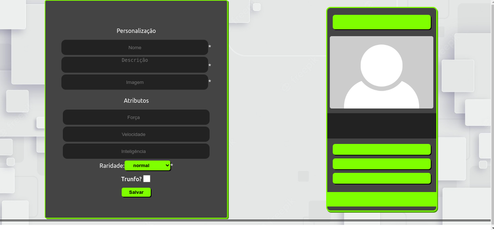
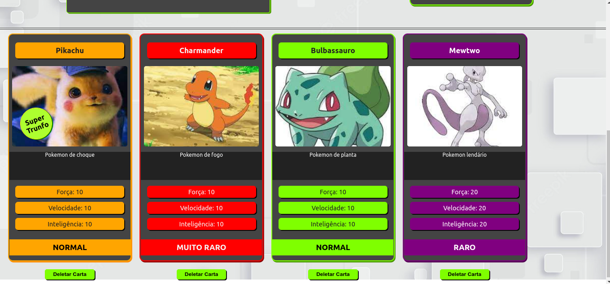

# 🃏 Projeto Tryunfo 🃏

https://tryunfo-iota.vercel.app/

<details>
  <summary>
    <h3> Descrição 📝</h3>
  </summary>
  Projeto feito durante o curso da <a href="https://www.betrybe.com/">Trybe</a> para testar os conhecimentos adquiridos.</br>
  Nele é feito a criação de cartas para uma partida de Trunfo. </br></br>
  
  <table>
    <tr>
      <td>Tecnologias Utilizadas</td>
    </tr>
    <tr>
      <td>
        <ul>
          <li>ReactJS</li>
          <li>JavaScript</li>
          <li>CSS</li>
          <li>Jest</li>
          <li>LocalStorage</li>
          <li>Bootstrap</li>
        </ul>
      </td>
    </tr>
  </table>
</details>

### Preview do projeto 💻

<div>
  
  
</div>

<details>
  <summary><h3>Como rodar localmente 👨‍💻</h3></summary></br>
  
 ⚠️ Necessário node na versão 16 ⚠️

1) Clone o repositório

```bash
$ git clone git@github.com:Bielbcs/tryunfo.git
```

2) Instale as dependências

```bash
$ npm install
```

3) Inicie o projeto

```bash
$ npm start
```

</details>
 
### 📞 Entre em contato 📞
 
 <div align="center" margin="50px">
	  <a href = "mailto:bielcotrimsv@gmail.com"></a>
	<a href="https://github.com/Bielbcs" target="_blank"></a>
  	<a href="https://www.linkedin.com/in/gabriel-bernardo-541661220/" target="_blank"></a>
</div>
 
